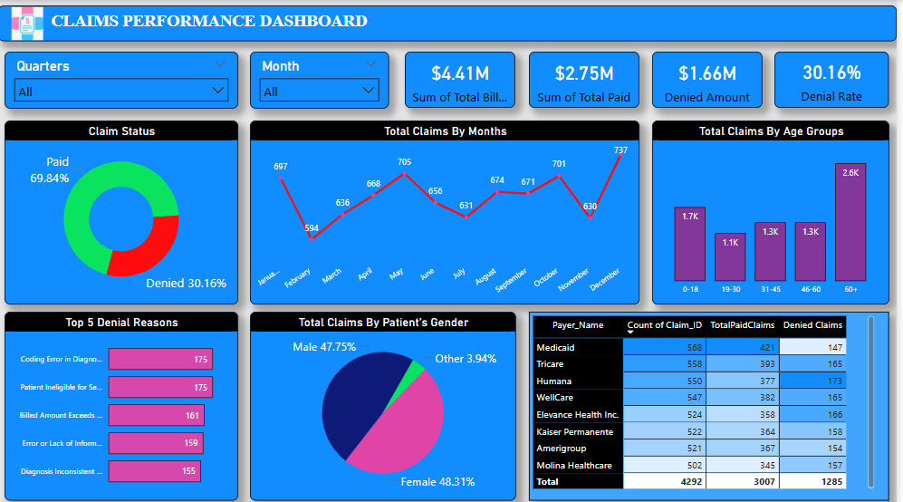

# 🏥 Claims Performance Dashboard

This Power BI project analyzes **US healthcare claim performance** using real-world-style sample data. The goal is to uncover trends in claims, identify denial patterns, and explore patient demographics.

---

## 📊 Dashboard Overview

The dashboard provides deep insights into:

- ✅ **Claim Status Breakdown** (Paid vs Denied)
- 📈 **Monthly Claim Volume**
- 📌 **Denial Rate and Denied Amount**
- 🔝 **Top 5 Denial Reasons**
- 🧓 **Claims by Patient Age Groups**
- 🧑‍🤝‍🧑 **Claims by Gender**
- 🏦 **Payer-wise Claims Performance**

---

## 📁 Files in This Repo

| File Name | Description |
|-----------|-------------|
| `Claims Analysis Dashboard.pbix` | Power BI file containing the dashboard and all visualizations |
| `US Healthcare Claims Dataset.zip` | The sample dataset used in this analysis |
| `README.md` | You’re reading it 🙂 |

---

## 🛠️ Tools Used

- **Power BI Desktop**
- **DAX** (Calculated Columns and Measures)
- **Power Query Editor** for data cleaning & transformation

---

## 📌 Business Goals

- Understand claim outcomes (paid vs denied)
- Spot top denial reasons to improve billing processes
- Analyze performance by payers and patient demographics

---

## 🖼️ Dashboard Preview

> Add a screenshot named `dashboard-screenshot.png` here to show how your final dashboard looks.

```md


